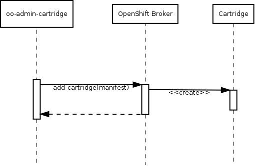
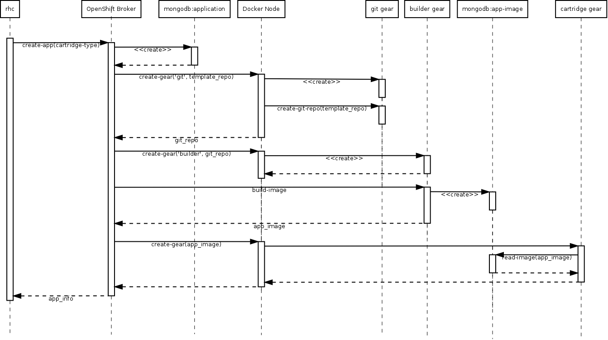

PEP: 010  
Title: Cartridge V3 and Docker Containers  
Status: draft  
Author: Clayton Coleman <ccoleman@redhat.com>, Paul Morie <pmorie@redhat.com>  
Arch Priority: high  
Complexity: 200  
Affected Components: web, api, runtime, cartridges, broker, admin_tools, cli  
Affected Teams: Runtime, UI), Broker, Enterprise  
User Impact: high  
Epic:  

Abstract
--------

Leverage Docker in OpenShift to deliver a more flexible and powerful distribution model for full
application stacks.  Each Docker image is like a full Operating System snapshot, but each image can
be composed of multiple layers (a set of commands and files that describe how to build on top of
each layer).  Users can easily create Docker layers and images and distribute them for execution in
other environments, even other Linux versions.  This PEP describes how the OpenShift cartridge and
gear format can evolve to leverage the full capabilities of Docker.

We would alter the build/deployment/cartridge model to focus more on image deployment - source code
changes are combined with a cartridge (build/deployment/execution environment) to create a docker
image that can be easily scaled up or rolled back to.  Users would be able to install their own
packages and run their gear images on their local laptops.  In addition, we would enable easier
distribution and execution mechanisms for cartridges that build on our existing system.  We would
enable more controlled upgrades, deployments, and version to version changes.

This PEP depends on and modifies [PEP 002: Cartridges
V2](https://github.com/openshift/openshift-pep/blob/master/openshift-pep-002-cartridge-v2.md).
It defines the use cases which [PEP 011: Docker
containerization](https://github.com/openshift/openshift-pep/blob/master/openshift-pep-010-docker-cartridges.md)
must address from a technical standpoint.

Background
----------

We hope to leverage the full capabilities of the Docker container, while working with the OpenStack
Solum project to evolve a new public standard that benefits developers and operators in the public
cloud.  We should take into account the limitations of the current mutable gear model and look for
opportunities to isolate components further (gears don't change, source code split out into its own
locations, routing moves out of gears and nodes).

A key design goal is to reduce the changes that occur inside of a gear after it is created - in
theory, reduce the changes to solely user application state, vs cartridge or gear state.

Core Concepts
-------------

A V2 OpenShift application is composed of 1..N gears.  Each gear represents an execution environment
for 1 primary cartridge and 0..N secondary cartridges (also called plugins).  Each gear maps to one
"container", which is a unix user, a SELinux category label, a home directory, and a set of exposed
ports.

A Docker gear should be a Docker container - which means that it is stopped and started via the
Docker control API, initialized with environment via the Docker run command, and expected to use the
same code from server to server.  The gear would be provided with mounted directories for mutable
data.  In order to guarantee that a gear would continue to function in isolation, the **gear image**
would be the result of combining the primary cartridge with the application source code (and any
build results).  This allows the gear image to be started on multiple servers as the result of a
scale up, without any communication required between gears.  Any change to a gear occurs on a build,
which means that a single process is responsible for user code changes, security updates, and
cartridge version changes.

An OpenShift cartridge is metadata that describes the capabilities of a set of software - likewise,
a Dockerfile is metadata describing how to prepare a set of software for use in an image.  In
OpenShift, we would treat the base Dockerfile elements - BASE, RUN, and EXECUTE - as new additions
to the cartridge manifest, and we would map the remaining metadata to existing OpenShift elements.

A Docker cartridge is a Docker image, with a set of metadata (a manifest) that can be translated to
a Dockerfile for execution during a build.  The Docker manifest adds additional elements to handle
the execution of steps and a RUN command.  V2 cartridges will have default values for these
(bin/setup and bin/control start).  The act of transforming a cartridge image with cartridge hooks
and/or source and build will be known as the **prepare** step ("preparing a cartridge"), and result
in a **deployment artifact** which is a Docker image.  Since **prepare** may contain dependencies, 
downloads, or unreliable options that may fail, subsequent **prepare** operations may wish to reuse
the contents of the prior image.

### What's in a deployment artifact (Docker layers)?

                                            +--------------+
                                            | Symlinks     |
                                            | Built WAR    |  Deployment Layer
                                            | User Source  |
                        +--------------+    +--------------+
                        | Scripts      |    | Scripts      |
                        | JBoss        |    | JBoss        |
                        | Maven        |    | Maven        |  Cartridge Layer
                        | OpenJDK      |    | OpenJDK      |
    +--------------+    +--------------+    +--------------+
    | Libc / Bash  |    | Libc / Bash  |    | Libc / Bash  |  Base Layer
    +--------------+    +--------------+    +--------------+

    +--------------+    +--------------+    +--------------+
    | Kernel       |    | Kernel       |    | Kernel       |
    +--------------+    +--------------+    +--------------+

    1. Base from CDN    2. Cartridge        3. Deployment
                                               Artifact

### Creating a deployment artifact (a gear image) flow

         +--------------+    +------------+     +-------------+
         | User Git     | OR | Binary     | AND | App         |
         | repo tarball |    | (WAR, zip) |     | Environment |
         +------+-------+    +------+-----+  +- +-------------+
                |                   |        |
                +---------------+   |    +---+  +--------------+
                                |   |    |      | Symlinks     |
                                |   |    |      | Built WAR    |
                                |   |    |      | User Source  |
    +--------------+            |   |    |      +--------------+
    | Scripts      |            |   |    |      | Scripts      |
    | JBoss        |            v   v    v      | JBoss        |
    | Maven        +------> invoke prepare +--->| Maven        +---> save as new
    | OpenJDK      |        script              | OpenJDK      |     image in Docker
    +--------------+                            +--------------+
    | Libc / Bash  |                            | Libc / Bash  |
    +--------------+                            +--------------+

    Cartridge Image                             Deployment Artifact

In V2 scalable applications, haproxy gears were responsible for distributing repository content to 
the gears in the application. In contrast, for Docker-based applications, the broker will manage 
which deployed artifact (DA) a gear is using. An auto scaling subsystem would make requests to the
broker to scale up or down.

Plugin cartridges are TBD, but they may be injected during the prepare step or bind mounted into the
gear after launch.

In order to deliver security updates to cartridges, the operator must be able to regenerate docker
images and then trigger builds in affected gears.  This is a long running operation and may also
involve skipping failed builds and notifying affected users.  Cartridge authors may need to 
provide additional functionality to allow incremental layer creation - reusing downloaded 
dependencies and generated files from a previous image - in order to ensure security updates do not
break user applications unintentionally.

Docker images live in a registry backed by some persistent storage.  OpenShift would need a registry
solution that allowed both public and private images. Public images would be where shared
cartridges come from, but private images would be isolated per account (domain?) and not visible to
others. The metadata describing cartridges would move to the broker, and be mediated via a set of
APIs for administrators and users. Over time, OpenShift might expose access to the registries to
external users so they can download and run gears locally.

OpenShift should support V2 cartridges and Docker cartridges side by side.

In order to advance both high availability and the evolution of the platform, moving HAProxy out of
the gears and into its own set of containers / layer would be ideal.  Further investigation is
needed, but a number of open source projects have advanced sufficiently to where full HA routing is
now possible without a deep investment.  In either case, the Routing SPI abstraction would allow us
to choose how and when to move this functionality out of the main gears.

### Write-once Gears

There are a number of advantages to making our gears and cartridges write-once - i.e., doing
cartridge installs, gear setup, and source builds together, and then reusing the result of that
change over and over.  Since the runtime for the cartridge is bundled with user code, users can
easily revert to a previous version in the event of an update.  Security updates and builds cannot
break running gears - they can only cause a new build to fail and there is always a rollback if the
new code doesn't work.  This has the potential to make security updates and gear migrations much
easier to control - pushing new cartridge versions can be done without causing users to immediately
break.

If gears are write-once, it would be better to force the choice of having state in those gears to be
explicit.  A large part of gear state today is the Git repository.  Moving the Git repository into
its own container (but still distributed on nodes) would allow us to add additional semantics to
those repositories while reusing existing concepts like SSH and cgroup limits.  OpenShift would
invoke a plugin to create the repository container on the appropriate node, and add a special API call
that the post-receive hook of the repository would use to notify OpenShift of a new commit.  The
gear repo would have access to the user's public keys as they do today (potentially within a
separate gear group).  During a prepare, OpenShift would extract the source for the application into
the cartridge image.

Another consequence of write-once gears is that application environment should exist outside any 
gear.  Docker applies environment on startup, so it would be ideal to distribute environment
via some private mechanism inside the node cluster and to pull that data on start.

This also enables the concept of compatible cartridges upgrades - for example from php-5.3 to
php-5.4 - where a user may start on one version of the technology and later want to move up (or
down) to a different compatible version.  The two cartridges have the same contract with the source
code, but a developer would be able to choose that new cartridge version to apply on a given build.

It is important to note that gears will still have ephemeral local storage for use in caching 
scenarios.

### Container security

In the Linux kernel the user namespace feature offers the ability for a container to have a root
user that is actually a normal-user on the system.  However, this feature is new and the potential
for vulnerabilities at this layer remains high.  In the short term (2013 into 2014), security
conscious container operators should still run containers as non-root.  In OpenShift, the focus will
be on enabling the use of images that may have been created or built with root access, but which at
execution time are still jailed to a normal user.  Trusted users may still be allowed to build
cartridges within the system, but still require a regular user for execution.

### Process management

Docker defines a container entrypoint -- an executable script or shell command -- that will be
executed when the container is started.  This entrypoint is expected to be a standard Unix process:

* It should respond to signals (like SIGTERM when docker is ready to shutdown)
* It should either log to disk, syslog, or STDERR/STDOUT
* When the process goes away, Docker considers the container stopped.

In general, cartridges should expose the lowest level process that can manage the work the cartridge
accomplishes.  Using SystemD or SysInit within a cartridge generally brings additional behavior that
prevents the platform itself (if not initially, then later) from offering advanced process
management.  An example would be restarting stuck processes - it would be better if the platform
(Docker, OpenShift, or OpenShift using SystemD) could track the stuck/failing state and expose that
information back to a user.  If the cartridge hides that from the platform, then it is much harder
to aggregate that information.

Another concern for cartridge authors - the signal Docker uses to terminate a process is SIGTERM,
and if a wrapper script is used that does not respond to SIGTERM, then the end result will be a
SIGKILL.  The process entrypoint should be sure to respond to SIGTERM gracefully.

SystemD integration with Docker is an area of active investigation - there are many process
management capabilities that would be ideal to manage from SystemD vs Docker / OpenShift.

### Log management

Different frameworks and languages offer different log capabilities, and many require significant
configuration to work in different modes.  OpenShift should offer platform tooling that simplifies
the scenarios described below where possible:

1. Allow cartridges to write log data to disk into transient or mounted volume directories.
2. Cartridge STDOUT/STDERR can be redirected by the platform to arbitrary locations.
3. Per-container syslog mounts could be exposed that a cartridge could write to.
4. Cartridge code can support language/framework specific log output that may go to external
   sources (log4j remote logging, etc)

As a cartridge author, information about how a cartridge logs should be exposed via the manifest,
and OpenShift would delegate that information as necessary to integrators.

Specification
-------------

### Changes to manifest.yml

A Docker manifest would look similar to a V2 manifest, with the addition of a "run" collection (list
of commands to run).  A Docker manifest is a strict superset of a dockerfile.

Dockerfile | V2 | Docker | Description
-----------|----|----|-------------
FROM       |*default* RHEL 6.5 OpenShift Node environment|Runtime (URL or known constant)|The base image this cartridge depends on.
MAINTAINER |-|Author|The author of this cartridge
RUN        |*default* bin/install and bin/setup|Run|The series of steps used to initialize this cartridge on disk
EXPOSE     |Endpoints|Endpoints|The internal ports and their metadata this cartridge exposes. Both V2 and Docker cartridges expose additional options as well as the protocol type.
ENV        |*default* created during bin/setup| |An environment key and value this image starts with
ADD        |SourceUrl| |A set of source files and destinations to copy into the container - Docker provides this at image creation time, OpenShift V2 allowed only an external URL that was downloaded into the root working directory
ENTRYPOINT |*default* bin/control start|Execute|An executable that will be run when the container starts.
CMD        |-|Execute|The default executable or arguments that will be run when the container starts. OpenShift docker cartridges require an executable, so a Dockerfile without CMD or ENTRYPOINT cannot be used as a cartridge.
VOLUME     |-| |A volume or directory that will be externally mounted into the running container.  Not supported in V2.
USER       |*default* gear user| |The Unix user the container processes will start under
WORKDIR    |*default* gear directory| |The working directory for the ENTRYPOINT
           | |Prepare|A path to a script (or an embedded script) that will be executed when a cartridge is **prepared**.

### Implementation Note: V2 Interoperability

V2 and Docker will operate side by side in a single OpenShift environment via application-based code
path switching.  The system will use two pools of nodes, one for V2 applications and one for Docker
applications, with appropriate runtimes running in the nodes of each pool.  New applications might
be created with a flag indicating the stack to use with the application, and those gears would run
only on nodes of the appropriate type.

The workflow to upgrade an application from the V2 cartridge system to the Docker cartridge system
is currently unspecified.

### Cartridge Author Workflow (basic case)

In the basic case, the cartridge author workflow is simple.  The cartridge author prepares a
manifest and uses the `oo-admin-ctl-cartridge` tool to upload the manifest to the OpenShift Broker.  The
manifest contains the following information:

1. A reference to a publicly available docker image for the cartridge (cartridge image)
2. A path within the cartridge image that is the `prepare` script
3. An optional URL to git repo to use as a template for the default git repo for the cartridge.
   The currently supported syntax using #&lt;commit&gt; at the end of the URL to denote a specific
   commit revision is supported.

The broker creates a record for the new cartridge.  The manifest is used as part of messages to
create new applications or add cartridges to an application, and therefore the manifest content is
contained in the record for the cartridge.  (TODO: add information re: versioning / streams)

### App Creation Workflow

The basic app creation workflow is as follows:

1. An OpenShift user calls `rhc app-create <type>`
2. `rhc` makes a rest call to the OpenShift broker to create a new application of the specified
   type
3. The OpenShift broker creates a record for the new application
4. The broker makes a call to a Docker node (an OpenShift node which is configured to support
   Docker-based gears) to create a source control container, passing the template git repo URL
    1. The node downloads the specified template repo
    2. The node creates a new git repository from the template content
5. The broker starts the prepare workflow

### Gear Image Preparation Workflow

The gear image preparation workflow is as follows:

1. The broker makes a call to create a builder gear, passing the manifest and git repo:
    1. The node downloads the application git repo into a known directory for bind-mount into
       the builder gear container
    2. If the manifest defines a prepare command, starts the container with
       `docker run -e <prepare cmd>`
    3. If not, the node starts the container with `docker run`
    4. The node waits for the container to finish running, imposing a timeout
    5. The node extracts from the container (method TBD) any necessary stateful information such as: environment
       variables, cartridge hooks, dynamic network endpoints
    6. The node performs a docker commit which creates the **deployment layer**
    7. The node pushes the docker image to the application's private docker registry
    8. The node reports the new deployment artifact (DA) id to the broker
2. The broker creates a new (DA) record for the application
3. The broker starts the deploy workflow

#### Incremental Image Preparation

The preparation described above is a **clean prepare** - completely regenerating the layer containing the user source code.  A consequence of a clean prepare is that the prepare script must redownload any dependencies of the application source (Ruby gems, Python eggs, Maven JARs).  This may result in the versions of those dependencies changing and the introduction of failures or bugs.  Therefore, there must be the possibility of an **incremental prepare** for security updates that allows a cartridge to reuse some or all of the previously generated content.

Potential problems caused by reusing a previous deployment layer:

* A cartridge might override system libraries with newer versions - those libraries might have the same security vulnerability that the system administrator is trying to patch
* Libraries updated in the deployment layer may be intermixed with libraries from the cartridge layer, and a new library added to the cartridge layer that also exists in the deployment layer might prevent the runtime from starting because of incompatible versions.  
* Update may require the rebuild of compiled dependecies or code in order to patch a vulnerability / bug
* The location of dependencies the cartridge expects may change

In all of these scenarios, the cartridge author and platform must coordinate around which content can be reused and when a full rebuild is required.

The incremental prepare workflow might look like:

1. The broker makes a call to create a builder gear, passing the manifest, git repo, and previous gear image id:
    1. The node downloads the application git repo into a known directory for bind-mount into
       the builder gear container
    2. The node fetches the deployment layer of the previous gear image by its id.
    3. The node calculates which contents from the previous image should be used in the new container, and if necessary copies them into the container.
    4. If the manifest defines a prepare command, starts the container with
       `docker run -e <prepare cmd>`
    3. If not, the node starts the container with `docker run`
    4. The container code must decide whether to reuse the previously generated contents, or whether to continue without them (if a file listing dependencies has changed, new dependencies must be downloaded).
    5. The node waits for the container to finish running, imposing a timeout
    6. The node extracts from the container (method TBD) any necessary stateful information such as: environment
       variables, cartridge hooks, dynamic network endpoints
    7. The node performs a docker commit which creates the **deployment layer**
    8. The node pushes the docker image to the application's private docker registry
    9. The node reports the new deployment artifact (DA) id to the broker
2. The broker creates a new (DA) record for the application
3. The broker starts the deploy workflow

#### Version upgrade

A prepare may result in the version of a cartridge in use changing in the broker - it may have been
input by the developer at build time.  An application may have multiple cartridge versions in
different gears as a result of a deploy.  The broker should gracefully handle rollforward and
rollback of this scenario:

1. Build and deploy v1 with PHP-5.3
2. Build and deploy v2 with PHP-5.4
3. Rollback to v1
4. Next build and deployment should use PHP-5.3

### Deployment Workflow

The deployment process is as follows:

1. Prepare a new version of the cartridge and get a DA id
2. Take the id of the new DA and begin updating the gears in the gear group with that new artifact
    1. For web cartridges, a scale up, scale down operation is ideal.
    2. For DB / stateful cartridges, a replace in place is ideal - stop the old container, keep the
       old stateful directories and ports as is, and then start the new container.
3. Once all gears are using the new DA, check whether the old DA should be deleted

## Gear management

Due to the write-once nature of Docker gears, there are significantly less operations that can be
performed on Docker gears than on V2 gears.  Operations that would mutate a V2 gear instead result 
in a new image being prepared for an application's web gears.  This makes it possible for there to 
be three fundamental operations that can be performed on Docker gears: scale up, scale down, and
replace.

### Scale Up Workflow

The scale up workflow is as follows:

1. The broker makes a call to scale up a new gear from a deployment ID:
    1.  The broker must provide sufficient information to the node for the node to securely retrieve
    the gear image. While the exact process will be defined elsewhere, the node is not assumed to
    have read access to all gear images in the system for security reasons.
    2. The node establishes process isolation for the gear container on the node.  This might be
    creating a unix user for a gear and/or creating selinux categories, etc.
    3. The node starts the container with the application's environment variables and a bind-mount into
    the application's external storage.
    4. The node makes the gear routable on a node-level.
2. The broker makes a call to the routing layer to route application requests to the new gear.

### Scale Down Workflow

1. The broker makes a call to the routing later to disable routing application requests to the 
   gear being scaled down.
2.  The broker makes a call to scale down the gear on the node:
    1.  The node gracefully stops the container
    2.  The node removes the node-level routing for the gear
    3.  The node removes any artifacts of process isolation for the gear

### Replace Workflow

1. The broker makes a call to the node where the gear is running to replace the gear, passing the 
   gear uuid and the DA id to replace to.
    1.  The node stops the container
    2.  The node restarts the container using the new DA

There are several use-cases that replace has to support with need to be further explored:

1. Avoid changing IP address or port bindings, as these would potentially necessitate 
   environment changes.
2. Endpoint changes across versions of DAs
3. Mountpoint changes across versions of DAs

Docker currently doesn't directly support switching out an image for a process and starting another
image with the same mounts / user / network bindings, but it has been requested.

## Upgrades

To upgrade a Docker gear (when a security update is released to a package):

1. Identify all the base cartridges that would be affected
2. For each cartridge:
   1. Rebuild the cartridge from its dockerfile
   2. Store the new version of the cartridge image alongside the old one
   3. Mark all the applications using the old cartridge image as needing a rebuild
3. For each application needing a rebuild
   1. Trigger a rebuild and redeploy

Plugin cartridges may complicate this story, and user installed packages complicate it further.  We
may need a mechanism for categorizing gears into a searchable repo for packages.

### Downloadable Cartridges

A downloadable V2 cart is a manifest that links to a source URL.  The Docker manifest should be a
superset of a dockerfile, which means that a user can specify a dockerfile as input to creating an
app, and that dockerfile will become a downloadable cart for the app.  When prepare happens for that
gear, we can easily build their custom cartridge as a base layer, then run prepare on top of it.  On
subsequent builds, the base cartridge could be refreshed (via a different mechanism probably) which
triggers a build.

### Moving HAProxy out of Gears

HAProxy within web gears complicates a number of processes.  For Docker, we should investigate the
creation and adoption of a routing layer to take edge traffic and route to gear groups based on
endpoint data the broker has been made aware of.  We will also investigate the ability to deploy
HAProxy gears within the application as a separate gear group.

At a routing level, a further topic of investigation is the separation of traffic into low-volume
/high-rate-of-change frontends, and high-volume/low-rate-of-change frontends.  Different
technologies might be chosen for each which would allow new applications to go into the low-volume
pool, and then moved into the high-volume pool via a DNS migration as an automated or administrative
process.

Additional Topics
-----------------

These topics need further investigation:

* Enabling the ability to run 'yum' in a container and how that affects root security
  * Needs discussion with Dan Walsh for security - need to elaborate all potential risks with
    RPM install inside container
* Disk usage of layers can be extreme:
  * Example is Java, where you may have 100M of base cartridge files, but Maven brings down
    1GB of data
  * Need to explore how builds and cartridges can coexist without making carts hard to write,
    and how we deal with lots of disk usage during prepare.
* Density of docker containers
* How can container hooks be supported - which are necessary and which are not
  * Should hooks be run at build time by passing in the info about the current app, and then
    the env vars are changed as the app is rolled out?
* Examples of individual scenarios for each type of cartridge
* Plugin cartridges - composition (more images and slower builds) or injection (limited
  capabilities)
  * Cron
  * Jenkins-client
* The exact process by which large number of gears are updated
* Details of how cartridges are built - we need to support multiple versions of each cartridge
  for much longer and the broker has to handle that
* Supporting arbitrary docker images (environment only injection)
* Updating a docker image in place (upgrade)
* Letting users define a cartridge as a dockerfile - downloadable cartridge replacement
* Gear migration across servers
* Quota and images (can be managed in thinp in gears, docker registry should give us more).
* Routing discussion, but we have 90% of everything we need
* How do port mappings and the port limit change?
* Is move still necessary?
* Where are environment variables stored?
  * In bind mount directory?
  * Env vars now have to be distributed to all nodes
* How are bind mounts from persistent per node storage managed?
  * Same as today, bind /var/lib/openshift/<gear>/data to an arbitrary location rather than inside
    home
* How does gear directory change?  No home mount automatic binding - home dir is transient per
  gear?
* Two carts with same contract with source repo but different operating systems
  * Both java-tomcat-maven, only one is supported
  * UI/broker groups them together so you get a choice (RHEL supported, Fedora community
    supported)
  * Community maintains one or the other
  * Still need RPMs eventually for real distributions
* SSH can be optionally implemented
  * Similar model but different behavior, LXC attach, krishna looking at it.
* How do we rebuild without grabbing new dependencies?  How do we do a security update that doesn't 
need a build efficiently?  If we take a security update and break because of a build dependency change,
that's worse than the security update breaking the app.
* Point to point image distribution between nodes is preferred, although it requires us to manage our
own availability.  Can't have redundancy for image backups without it.

Risks
-----

* Density changes from high thousands
* Cost to update gears
