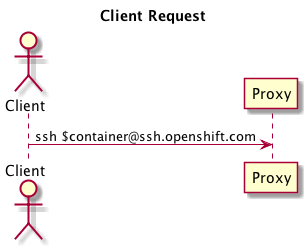
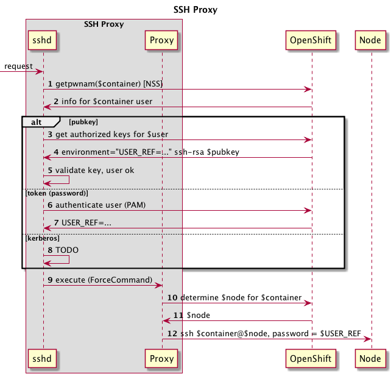
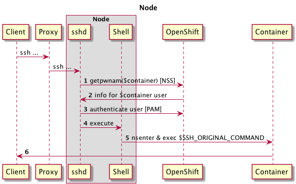

PEP: 014  
Title: OpenShift 3 SSH Proxy  
Status: draft  
Author: Andy Goldstein <agoldste@redhat.com>  
Arch Priority: medium  
Complexity: 40  
Affected Components: apiserver  
Affected Teams: Runtime, Infrastructure  
User Impact: low  
Epic: [SCM](https://trello.com/c/L1Df40pk/68-source-control-management-scm)

Abstract
--------
Create a proxy service for users to access cluster resources via SSH. The proxy provides an abstraction from the physical location of the requested resource; if the resource moves, its URI remains unchanged, so clients don't have to update their configurations. Examples of cluster resources the proxy may support: SSH access to containers, port forwarding.

Motivation
----------
- Provide a consistent URI to cluster resources
- Allow resources to move within the cluster without requiring client configuration updates
- Avoid single points of failure


Specification
-------------
### SSH proxy components
The SSH proxy is comprised of the following pieces:

- sshd from OpenSSH
- a custom AuthorizedKeysCommand
- a custom NSS module to delegate user lookups to OpenShift
- a custom PAM module to
	- delegate password authentication to OpenShift
	- securely lookup and store a user identifier in the session's environment
- a custom executable to perform the proxying logic

The SSH proxy is stateless, in as much as multiple proxies can exist behind a load balancer and/or something like round-robin DNS. Doing so eliminates the proxy layer from being a single point of failure.

--

### Basic flow
The SSH proxy accepts incoming requests from remote clients (users), asserts authentication and authorization, and forwards the requests to the appropriate backend cluster resources:


This is a simplified version of what actually happens, as we need to handle authentication, authorization, and determine to which backend resource the original request should be forwarded.

--

### Client request
Let's look at what would happen when SSHing to a container. First, the client would run a command such as

```
ssh $container@ssh.openshift.com
```

where $container is the ID of the desired container.



### Proxy actions

`sshd` running in the proxy receives the request and performs the following sequence of steps relevant to OpenShift:



#### Steps 1 & 2: lookup $container via NSS
`sshd` looks up information about the $container (user) via the `getpwnam` system call. This uses NSS to retrieve the information based on the configuration in `/etc/nsswitch.conf`. For the SSH proxy, this file must be configured to use a custom NSS module that asks OpenShift for this user information.

#### Steps 3 - 8: authentication
##### Public key authentication
`sshd` uses a custom `AuthorizedKeysCommand` to ask OpenShift for a list of public keys allowed to access $container. This command runs as `AuthorizedKeysCommandUser`, which must be an isolated user that has a private means of authenticating with OpenShift (e.g. a client certificate or token). `sshd` performs the key exchange with the client and allows the client to proceed if the client's key is in the list of authorized keys retrieved from OpenShift.

OpenShift also returns a "user reference token" environment variable that specifies the actual user associated with the public key. This variable is used later on as the password when the proxy SSHes to the container's node.

##### Token (password) authentication
The client presents a token as a password to `sshd`. `sshd` delegates password authentication to PAM. PAM is configured to delegate authentication to OpenShift. If authentication succeeds, OpenShift returns the "user reference token" and the PAM module sets it as an environment variable for the session.

##### Kerberos authentication
**TODO**

#### Step 9: execute proxy command
After the user has successfully logged in, `sshd` executes the `ForceCommand` specified in `sshd_config`, a custom executable that provides the proxying logic.

#### Steps 10 & 11: determine container's node
The proxy asks OpenShift on which node the container resides.

#### Step 12: forward request to node
The proxy forwards the original SSH request to the node, using $USER_REF as the password token for authentication.

--

### Node actions


#### Steps 1 & 2: lookup user ($container) via NSS
`sshd` looks up information about the $container (user) via the `getpwnam` system call. This uses NSS to retrieve the information based on the configuration in `/etc/nsswitch.conf`. For the node, this file must be configured to use a custom NSS module that asks OpenShift for this user information.

#### Step 3: authenticate
The SSH proxy presents the user reference token as a password to `sshd`. `sshd` delegates password authentication to PAM. PAM is configured to delegate authentication to OpenShift.

#### Steps 4 & 5: execute original command
`sshd` executes a custom shell that `nsenter`s the target container's namespaces and executes $SSH_ORIGINAL_COMMAND.

--

### MCS label assignment
Distinct users in a multi-tenant environment (SSH proxy container, Git backend container, etc.) should not be allowed to view each others' files. Giving each Linux user its own SELinux context and setting the execution context of a user's processes provides this inter-user isolation.

OpenShift 2 uses a custom PAM module, [pam_openshift](https://github.com/openshift/origin-server/tree/master/pam_openshift), to set the SELinux context when a user interacts with a gear via SSH. OpenShift 3 could continue to use this module, or it might be possible to use `pam_selinux` and the custom dynamic environment variable PAM module described below to set `SELINUX_LEVEL_REQUESTED` above `pam_selinux` in the PAM stack.

### SSSD integration?
Consider using SSSD in the SSH proxy container and the various backend containers (Git, etc.) to cache public keys.