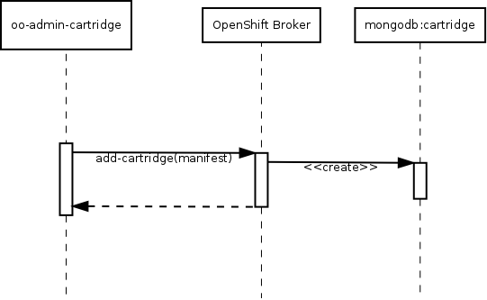

PEP: 010  
Title: Cartridge V3 and Docker Containers  
Status: draft  
Author: Clayton Coleman <ccoleman@redhat.com>, Paul Morie <pmorie@redhat.com>, Ben Parees <bparees@redhat.com>  
Arch Priority: high  
Complexity: 200  
Affected Components: web, api, runtime, cartridges, broker, admin_tools, cli  
Affected Teams: Runtime, UI), Broker, Enterprise  
User Impact: high  
Epic:  

Abstract
--------

Leverage Docker in OpenShift to deliver a more flexible and powerful distribution model for full
application stacks.  Each Docker image is like a full Operating System snapshot, but each image can
be composed of multiple layers (a set of commands and files that describe how to build on top of
each layer).  Users can easily create Docker layers and images and distribute them for execution in
other environments, even other Linux versions.  This PEP describes how the OpenShift cartridge and
gear format can evolve to leverage the full capabilities of Docker.

We would alter the build/deployment/cartridge model to focus more on image deployment - source code
changes are combined with a cartridge (build/deployment/execution environment) to create a docker
image that can be easily scaled up or rolled back to.  Users would be able to install their own
packages and run their gear images on their local laptops.  In addition, we would enable easier
distribution and execution mechanisms for cartridges that build on our existing system.  We would
enable more controlled upgrades, deployments, and version to version changes.

This PEP depends on and modifies [PEP 002: Cartridges
V2](https://github.com/openshift/openshift-pep/blob/master/openshift-pep-002-cartridge-v2.md).

Background
----------

We hope to leverage the full capabilities of the Docker container to evolve a new public standard
that benefits developers and operators in the public cloud.  We should take into account the
limitations of the current mutable gear model and look for opportunities to isolate components
further (gears don't change, source code split out into its own locations, routing moves out of gears
and nodes).

A key design goal is to reduce the changes that occur inside of a gear after it is created - in
theory, reduce the changes to solely user application state, rather than cartridge or gear state.

Core Concepts
-------------

A V2 OpenShift application is composed of 1..N gears.  Each gear represents an execution environment
for 1 primary cartridge and 0..N secondary cartridges (also called plugins).  Each gear maps to one
"container", which is a unix user, a SELinux category label, a home directory, and a set of exposed
ports.

A Docker gear should be a Docker container - which means that it is stopped and started via the
Docker control API, initialized with environment via the Docker run command, and expected to use the
same code from server to server.  The gear would be provided with mounted directories for mutable
data.  In order to guarantee that a gear would continue to function in isolation, the **gear image**
would be the result of combining the primary cartridge with the application source code (and any
build results).  This allows the gear image to be started on multiple servers as the result of a
scale up, without any communication required between gears.  Any change to a gear occurs on a build,
which means that a single process is responsible for user code changes, security updates, and
cartridge version changes.

An OpenShift v2 cartridge is metadata that describes the capabilities of a set of software - likewise,
a Dockerfile is metadata describing how to prepare a set of software for use in an image.  

OpenShift v3 cartridges will consist of an arbitrary Docker image, plus a set of [Source-To-Image](https://github.com/openshift/geard/tree/master/sti)
scripts which define the assemble(build) and run behavior of the cartridge.  The act of transforming
a Docker image with STI scripts and/or source will be known as the **build** step,
and result in a **deployment artifact** which is a Docker image.  Since **build** process
may contain dependencies, downloads, or unreliable options that may fail, subsequent **build** operations may wish
to reuse the contents of the prior image.  This is referred to as an **incremental build**.

### What's in a deployment artifact (Docker layers)?

                                          +-----------------+
                                          | Symlinks        |  Deployment Layer
                                          | Built WAR       |
                                          | Startup Scripts |
                       +--------------+   +-----------------+
                       | Maven        |   | Maven (unused)  |  Cartridge Layer
                       | JBoss        |   | JBoss           |
    +--------------+   +--------------+   +-----------------+
    | Libc / Bash  |   | Libc / Bash  |   | Libc / Bash     |  Base Layer
    +--------------+   +--------------+   +-----------------+

    +--------------+   +--------------+   +-----------------+
    | Kernel       |   | Kernel       |   | Kernel          |
    +--------------+   +--------------+   +-----------------+

    1. Base from CDN   2. Generic         3. Deployment
                          Docker             Artifact
                          Image             

### Creating a cartridge flow

                                                +-------------------+
                    Author sti scripts -------> |STI scripts        | External to docker image
                    Author metadata    -------> |Cartridge metadata |
                                                +-------------------+

                                                +--------------+
                                                | Maven        |
    +--------------+                            +--------------+
    |              |------> Add build deps +--->|              +---> save as new
    | JBoss        |                            | JBoss        |     image in Docker
    +--------------+                            +--------------+
    | Libc / Bash  |                            | Libc / Bash  |
    +--------------+                            +--------------+

    Generic Image                                Cartridge

### Creating a deployment artifact from user source flow

                         +--------------+   +--------------+
                         | STI scripts  |   | User source  |
                         | Cart metadata|   | (git, local) |
                         +------+-------+   +------+-------+
                                |                  |
    +--------------+            +------------------+
    | Maven        |            |
    +--------------+            v               +--------------+
    |              |------>   build   --------->| Built WAR    |
    | JBoss        |                            +-------+------+
    +--------------+                                    |
    | Libc / Bash  |                                    |
    +--------------+                                    |
                                    +-------------------+
    Docker Image                    |
                                    |               +--------------+
                                    |               | Start scripts|
                                    |               | Symlinks     |
                                    v               | Built WAR    |
                            create deployment +---->+--------------+
                            artifact                | Maven        |
                                                    +--------------+
                                                    | JBoss        |
                                                    +--------------+
                                                    | Libc / Bash  |
                                                    +--------------+

                                                    Deployable image

### Incremental Builds

Once a deployment artifact has been built, subsequent rebuilds of the same artifact
(either due to application source changes, or to pick up a security fix to a lower
layer of the image) can be optimized by reusing artifacts (eg downloaded dependencies)
from the first build.

Image authors can achieve this by providing a save-artifacts script that will archive
useful bits from the old image.  Those bits will be made available to the assemble
script during the build.

                         +--------------+   +--------------+  +--------------+
                         | STI scripts  |   | User source  |  | Previous     |
                         | Cart metadata|   | (git, local) |  | image        |
                         +------+-------+   +------+-------+  +------+-------+
                                |                  |                 |
                                |                  |            save-artifacts
                                |                  |                 |
                                |                  |                 v
                                |                  |          +--------------+
                                |                  |          | artifacts    |
                                |                  |          |              |
                                |                  |          +------+-------+
                                |                  |                 |
                                |                  |                 |
    +--------------+            +------------------+-----------------+
    | Maven        |            |
    +--------------+            v               +--------------+
    |              |------>   build   --------->| Built WAR    |
    | JBoss        |                            +-------+------+
    +--------------+                                    |
    | Libc / Bash  |                                    |
    +--------------+                                    |
                                    +-------------------+
    Docker Image                    |
                                    |               +--------------+
                                    |               | Start scripts|
                                    |               | Symlinks     |
                                    v               | Built WAR    |
                            create deployment +---->+--------------+
                            artifact                | Maven        |
                                                    +--------------+
                                                    | JBoss        |
                                                    +--------------+
                                                    | Libc / Bash  |
                                                    +--------------+

                                                    Deployable image

### Extended Builds

In some cases, it may not make sense for packages required to build an application also
be present in the deployed image.  For example, maven may be required to build some
java applications, but it is not needed to run them.  To address these scenarios,
extended builds will be supported.  In an extended build, one image is used to perform
the build and output the deployable application artifacts.  Those artifacts are then
added to the runtime framework image to create the deployable artifact.

                         +--------------+   +--------------+
                         | STI scripts  |   | User source  |
                         | Cart metadata|   | (git, local) |
                         +------+-------+   +------+-------+
                                |                  |
    +--------------+            +------------------+
    | Maven        |            |
    |              |            v               +--------------+
    +--------------+------>   build   --------->| Built WAR    |
    |              |                            +-------+------+
    | Libc / Bash  |                                    |
    |              |                                    |
    +--------------+                                    |
                                    +-------------------+
    Docker Image                    |
                                    |               +--------------+
                                    |               | Start scripts|
                                    |               | Symlinks     |
    +--------------+                v               | Built WAR    |
    | JBoss        |        create deployment +---->+--------------+
    +--------------+------> artifact                | Maven        |
    | Libc / Bash  |                                +--------------+
    +--------------+                                | JBoss        |
                                                    +--------------+
                                                    | Libc / Bash  |
    Docker Image                                    +--------------+

                                                    Deployable image

### Creating a deployment artifact from binary flow

Because the STI scripts which perform the build are generic, the input "source" can
be pre-compiled artifacts (such as a war) which will be directly deployed, rather than
performing a build step (such as maven build).

                         +--------------+   +--------------+
                         | STI scripts  |   | Built war    |
                         | Cart metadata|   |              |
                         +------+-------+   +------+-------+
                                |                  |
    +--------------+            +------------------+
    | Maven        |            |
    +--------------+            v               +--------------+
    |              |------>  skip build ------->| Built WAR    |
    | JBoss        |                            +-------+------+
    +--------------+                                    |
    | Libc / Bash  |                                    |
    +--------------+                                    |
                                    +-------------------+
    Docker Image                    |
                                    |               +--------------+
                                    |               | Start scripts|
                                    |               | Symlinks     |
                                    v               | Built WAR    |
                            create deployment +---->+--------------+
                            artifact                | Maven        |
                                                    +--------------+
                                                    | JBoss        |
                                                    +--------------+
                                                    | Libc / Bash  |
                                                    +--------------+

                                                    Deployable image

In V2 scalable applications, haproxy gears were responsible for distributing repository content to
the gears in the application. In contrast, for Docker-based applications, the broker will manage
which deployed artifact (DA) a gear is using. An auto scaling subsystem would make requests to the
broker to scale up or down.

Plugin cartridges are TBD, but they may be injected during the prepare step or bind mounted into the
gear after launch.

In order to deliver security updates to cartridges, the operator must be able to rebuild (docker build)
docker images and then trigger application builds for affected applications to create a new deployable
images for those applications.  This is a long running operation and may also involve skipping failed builds
and notifying affected users.  In order to optimize the rebuild process and exert control over application
dependencies that may have been previously downloaded, cartridge authors can provide additional functionality
to allow incremental layer creation - reusing downloaded dependencies and generated files from a previous
image.  See "incremental builds" for more details.

Docker images live in a registry backed by some persistent storage.  OpenShift requires a registry
solution that allows both public and private images. Public images would be where shared
cartridges come from, but private images would be isolated per account (domain?) and not visible to
others. The metadata describing cartridges would move to the broker, and be mediated via a set of
APIs for administrators and users. Over time, OpenShift might expose access to the registries to
external users so they can download and run gears locally.

OpenShift should support V2 cartridges and Docker cartridges side by side.

In order to advance both high availability and the evolution of the platform, we will move HAProxy out of
the gears and into its own set of containers / layer.  V3 will introduce a routing
layer that operates above the gear layer, removing the requirement for applications to manage their
own load balancing.

### Write-once Gears

There are a number of advantages to making our gears and cartridges write-once - i.e., doing
cartridge installs, gear setup, and source builds together, and then reusing the result of that
change over and over.  Since the runtime for the cartridge is bundled with user code, users can
easily revert to a previous version in the event of an update.  Security updates and builds cannot
break running gears - they can only cause a new build to fail and there is always a rollback if the
new code doesn't work.  This has the potential to make security updates and gear migrations much
easier to control - pushing new cartridge versions can be done without causing users to immediately
break.

If gears are write-once, it would be better to force the choice of having state in those gears to be
explicit.  A large part of gear state today is the Git repository.  Moving the Git repository into
its own container (but still distributed on nodes) would allow us to add additional semantics to
those repositories while reusing existing concepts like SSH and cgroup limits.  OpenShift would
invoke a plugin to create the repository container on the appropriate node, and add a special API call
that the post-receive hook of the repository would use to notify OpenShift of a new commit.  The
gear repo would have access to the user's public keys as they do today (potentially within a
separate gear group).  During a build, OpenShift would extract the source for the application into
the cartridge image.

Another consequence of write-once gears is that application environment should exist outside any
gear.  Docker applies environment on startup, so it would be ideal to distribute environment
via some private mechanism inside the node cluster and to pull that data on start.

This also enables the concept of compatible cartridges upgrades - for example from php-5.3 to
php-5.4 - where a user may start on one version of the technology and later want to move up (or
down) to a different compatible version.  The two cartridges have the same contract with the source
code, but a developer would be able to choose that new cartridge version to apply on a given build.

It is important to note that gears will still have ephemeral local storage for use in caching
scenarios.

### Quickstarts and InstantApps

For the first iteration, the multicartridge topologies defined by instant apps will be created by
single docker images that contain all the component pieces.  Quickstarts (external initial source
repo) should continue to work as today by providing a github repo during app creation.  STI
already supports this model for building images from a remote source repository.

### Container security

In the Linux kernel the user namespace feature offers the ability for a container to have a root
user that is actually a normal-user on the system.  However, this feature is new and the potential
for vulnerabilities at this layer remains high.  In the short term (2013 into 2014), security
conscious container operators should still run containers as non-root.  In OpenShift, the focus will
be on enabling the use of images that may have been created or built with root access, but which at
execution time are still jailed to a normal user.  Trusted users may still be allowed to build
images within the system, but still require a regular user for execution.

### Process management

Docker defines a container entrypoint -- an executable script or shell command -- that will be
executed when the container is started.  This entrypoint is expected to be a standard Unix process:

* It should respond to signals (like SIGTERM when docker is ready to shutdown)
* It should either log to disk, syslog, or STDERR/STDOUT
* When the process goes away, Docker considers the container stopped.

The easiest approach to this is for the entrypoint to perform an exec.

In general, cartridges should expose the lowest level process that can manage the work the cartridge
accomplishes.  Using SystemD or SysInit within a cartridge generally brings additional behavior that
prevents the platform itself (if not initially, then later) from offering advanced process
management.  An example would be restarting stuck processes - it would be better if the platform
(Docker, OpenShift, or OpenShift using SystemD) could track the stuck/failing state and expose that
information back to a user.  If the cartridge hides that from the platform, then it is much harder
to aggregate that information.

Another concern for cartridge authors - the signal Docker uses to terminate a process is SIGTERM,
and if a wrapper script is used that does not respond to SIGTERM, then the end result will be a
SIGKILL.  The process entrypoint should be sure to respond to SIGTERM gracefully.

SystemD integration with Docker is an area of active investigation - there are many process
management capabilities that would be ideal to manage from SystemD vs Docker / OpenShift.

The Source-To-Image model allows for cartridge authors to define a "run" script which will be the
default CMD for the deployable artifact image.  If a "run" script is not provided at build time,
the resulting image will use the CMD or ENTRYPOINT defined by the input image.

### Healthchecking/Liveness

Containers for a cartridge can be checked for liveness via port connectivity, or by providing a script
which will be run inside the container namespace.  The cartridge manifest will define how the
container should be probed.

Applications will also be able to define an application-level health check, but that is beyond the
scope of cartridges.

### Log management

Cartridges will log to stdout (where it will be captured to journald by the host) or handled by the
cartridge directly (eg logging to an external logging service).

### Metrics

Cartridges will be free to record and report metrics to external services (eg New Relic).
It is not yet clear if OpenShift will provide a built in metric aggregation/reporting service
for cartridges to use.

### Environment Variables

Environment variables are managed by docker itself, and in turn can be fed in from an external
orchestrator.  Managing them will not be a cartridge responsibility.  Environment variables can
be used to feed into dynamic configuration settings at startup/runtime.

### Runtime configuration

Many runtimes require configuration customization.  V3 will support two approaches to supplying this
configuration information:
1) Cartridge startup scripts can process environment variables to populate a configuration template
2) Cartridge assemble scripts can pull in configuration files supplied by the application source
   repository.

Note that 1+2 can be used in conjunction as well.

### Information sharing

In V2, cartridges could publish and subscribe to specific bits of information such as database
passwords or lists of cluster members.  

For v3, we will initially limit the information sharing use cases to information that can be
pre-generated and fed into the runtime container via environment variables.  For example,
cartridges can define an environment variable "POSTGRES_PASSWORD" and indicate that the
variable should be auto-generated by the platform.  At application creation time, the
platform will generate a value for the environment variable and share it with all containers
which are linked to this container and have expressed a subscription to this environment
variable.

Similarly, aggregated values such as an environment variable value that consists of a comma
separated list of all the hostnames in a cluster will be managed by the platform constructing
the aggregated value and injecting it into all interested containers.  This will be done in
cases where the cartridge has indicated the value should be aggregated, and optionally provided
a delimeter.

### Downloadable Cartridges

Downloadable cartridges will no longer exist as a distinct entity in v3.  All cartridges consist
of an arbitrary docker image plus a well defined set of scripts/manifest data.  There
is no need for a distinction between "system" and "downloaded" cartridges.

### Moving HAProxy out of Gears

HAProxy within web gears complicates application lifecycle management and scaling.  To address this,
we will create a routing layer to route edge traffic to gear groups based on endpoint data
the broker has been made aware of.  

Specification
-------------

### Changes to manifest.yml

As a starting point, we will adapt the existing manifest.yml format with the following changes:

Fields removed        | Reason
----------------------|----------------------------------------------------------------------------------
Compatible-Versions   | There is no concept of cartridge migration in v3, applications are simply rebuilt
                      | with the new catridge version and either work, or are rolled back
                      |
Group-Overrides       | All cartridges will run in their own gear
                      |
Source-Url            | Cartridge "source" is now the docker image supplied to the build command
Source-MD5            | No longer applicable

Fields added          | Description
----------------------|----------------------------------------------------------------------------------
Image-name            | Docker image to be used if an image was not specified during "Build" invocation
Template-location     | Optional git url to use as the template app for new instances
Storage-path          | Location of volume mounted storage the cartridge expects to be able to write persisted data to
Liveness-check        | Mechanism for checking if the container is started/live (port(s) to probe, script(s) to run)

### Implementation Note: V2 Interoperability

The workflow to upgrade an application from the V2 cartridge system to the Docker cartridge system
is currently unspecified.

### Cartridge Author Workflow (basic case)

In the basic case, the cartridge author workflow is simple.  The cartridge author prepares a
manifest and uses the `oo-admin-ctl-cartridge` tool to upload the manifest to the OpenShift Broker.  The
manifest contains the following information:

1. A reference to a publicly available docker image for the cartridge (cartridge image)
2. An optional URL to git repo to use as a template for the default git repo for the cartridge.
   The currently supported syntax using #&lt;commit&gt; at the end of the URL to denote a specific
   commit revision is supported.

The broker creates a record for the new cartridge.  The manifest is used as part of messages to
create new applications or add cartridges to an application, and therefore the manifest content is
contained in the record for the cartridge.  (TODO: add information re: versioning / streams)

(Open Question:  how should STI scripts be handled?  imported?  location referenced in manifest?)

### App Creation Workflow

The basic app creation workflow is as follows:

1. An OpenShift user calls `rhc app-create <type>`
2. `rhc` makes a rest call to the OpenShift broker to create a new application of the specified
   type
3. The OpenShift broker creates a record for the new application
4. The broker makes a call to a Docker node (an OpenShift node which is configured to support
   Docker-based gears) to create a source control container, passing the template git repo URL
    1. The node downloads the specified template repo
    2. The node creates a new git repository from the template content
5. The broker starts the build workflow

### Gear Image Build Workflow

The gear image preparation workflow is as follows:

1. The broker makes a call to create a builder gear, passing the manifest and git repo:
    1. The builder component invokes "gear build" passing the image name from the manifest and the
       location of the new application repository
    2. The build component waits for the build to finish running, imposing a timeout
    3. At completion, the deployable image has been committed
    4. The build component pushes the docker image to the application's private docker registry
    5. The node reports the new deployment artifact (DA) id to the broker
2. The broker creates a new (DA) record for the application
3. The broker starts the deploy workflow

#### Incremental Image Preparation

The preparation described above is a **clean prepare** - completely regenerating the layer containing the user source code.  A consequence of a clean prepare is that the prepare script must redownload any dependencies of the application source (Ruby gems, Python eggs, Maven JARs).  This may result in the versions of those dependencies changing and the introduction of failures or bugs.  Therefore, there must be the possibility of an **incremental build** for security updates that allows a cartridge to reuse some or all of the previously generated content.

Potential problems caused by reusing a previous deployment layer:

* A cartridge might override system libraries with newer versions - those libraries might have the same security vulnerability that the system administrator is trying to patch
* Libraries updated in the deployment layer may be intermixed with libraries from the cartridge layer, and a new library added to the cartridge layer that also exists in the deployment layer might prevent the runtime from starting because of incompatible versions.  
* Update may require the rebuild of compiled dependecies or code in order to patch a vulnerability / bug
* The location of dependencies the cartridge expects may change

In all of these scenarios, the cartridge author and platform must coordinate around which content can be reused and when a full rebuild is required.

The incremental build workflow is:

1. The broker makes a call to create a builder gear, passing the manifest and git repo, and previous gear image id:
    1. The builder component invokes "gear build" passing the image name from the manifest, location of the application repository, and the previous image id
    2. The build process extracts dependencies from the previous image and bind-mounts them into the new image during the normal build flow
    3. The build component waits for the build to finish running, imposing a timeout
    4. At completion, the deployable image has been committed
    5. The build component pushes the docker image to the application's private docker registry
    6. The node reports the new deployment artifact (DA) id to the broker
2. The broker creates a new (DA) record for the application
3. The broker starts the deploy workflow
4. If the new image fails to deploy, the application is rolled back to the previous working image

#### Version upgrade

A build may result in the version of a cartridge in use changing in the broker - it may have been
input by the developer at build time.  An application may have multiple cartridge versions in
different gears as a result of a deploy.  The broker should gracefully handle rollforward and
rollback of this scenario:

1. Build and deploy v1 with PHP-5.3
2. Build and deploy v2 with PHP-5.4
3. Rollback to v1
4. Next build and deployment should use PHP-5.3

### Deployment Workflow

The deployment process is as follows:

1. Prepare a new version of the cartridge and get a DA id
2. Take the id of the new DA and begin updating the gears in the gear group with that new artifact
    1. For web cartridges, a scale up, scale down operation is ideal.
    2. For DB / stateful cartridges, a replace in place is ideal - stop the old container, keep the
       old stateful directories and ports as is, and then start the new container.
3. Once all gears are using the new DA, check whether the old DA should be deleted

## Gear management

Due to the write-once nature of Docker gears, there are significantly less operations that can be
performed on Docker gears than on V2 gears.  Operations that would mutate a V2 gear instead result
in a new image being prepared for an application's web gears.  This makes it possible for there to
be three fundamental operations that can be performed on Docker gears: scale up, scale down, and
replace.

### Scale Up Workflow

The scale up workflow is as follows:

1. The broker makes a call to scale up a new gear from a deployment ID:
    1.  The broker must provide sufficient information to the node for the node to securely retrieve
    the gear image. While the exact process will be defined elsewhere, the node is not assumed to
    have read access to all gear images in the system for security reasons.
    2. The node establishes process isolation for the gear container on the node.  This might be
    creating a unix user for a gear and/or creating selinux categories, etc.
    3. The node starts the container with the application's environment variables and a bind-mount into
    the application's external storage.
    4. The node makes the gear routable on a node-level.
2. The broker makes a call to the routing layer to route application requests to the new gear.

### Scale Down Workflow

1. The broker makes a call to the routing later to disable routing application requests to the
   gear being scaled down.
2.  The broker makes a call to scale down the gear on the node:
    1.  The node gracefully stops the container
    2.  The node removes the node-level routing for the gear
    3.  The node removes any artifacts of process isolation for the gear

### Replace Workflow

1. The broker makes a call to the node where the gear is running to replace the gear, passing the
   gear uuid and the DA id to replace to.
    1.  The node stops the container
    2.  The node restarts the container using the new DA

There are several use-cases that replace has to support with need to be further explored:

1. Avoid changing IP address or port bindings, as these would potentially necessitate
   environment changes.
2. Endpoint changes across versions of DAs
3. Mountpoint changes across versions of DAs

Docker currently doesn't directly support switching out an image for a process and starting another
image with the same mounts / user / network bindings, but it has been requested.

## Upgrades

To upgrade a Docker gear (when a security update is released to a package):

1. Identify all the base images that would be affected
2. For each cartridge:
   1. Rebuild the image from its dockerfile
      * Not all base images will be under OpenShift control as any docker image can be a base image for a cartridge
   2. Store the new version of the cartridge image alongside the old one
   3. Mark all the applications using the old cartridge image as needing a rebuild
3. For each application needing a rebuild
   1. Trigger a rebuild and redeploy

Plugin cartridges may complicate this story, and user installed packages complicate it further.  We
may need a mechanism for categorizing gears into a searchable repo for packages.

## Cartridge Migration from 2.x
Cartridges developed for OpenShift 2.x may be supported by the Docker-based 3.x OpenShift architecture.
This can be done by delegating the invocation of commands such as "control build" and "control start" to
the new assemble and run scripts, respectively.  Details which need to be worked out to support wrappering
2.x cartridges inside a 3.x image include:
  1. How will publish/subscribe hooks be handled
  1. How will references to legacy OPENSHIFT_* environment variables be managed
  1. How will 2.x action_hooks be mapped to 3.x action hook invocations, assuming 3.x even has action hooks
  1. Support libraries traditionally found on the openshift node need to be supplied in the base image (this would
  include both the runtime binaries for the framework and also helper scripts like the openshift bash sdk)
  1. 2.x cartridges can create new environment variables during setup/install, how can this be supported in the
  3.x environment variable architecture?

Additional Topics
-----------------

These topics need further investigation:

* Enabling the ability to run 'yum' in a container and how that affects root security
  * Needs discussion with Dan Walsh for security - need to elaborate all potential risks with
    RPM install inside container
  * Container namespacing should eventually allow users to be "root" inside their containers without
    exposing the host system  

* Disk usage of layers can be extreme:
  * Example is Java, where you may have 100M of base cartridge files, but Maven brings down
    1GB of data
  * Need to explore how builds and cartridges can coexist(???) without making carts hard to write,
    and how we deal with lots of disk usage during build.

* Density of docker containers
  * Memory cost due to shared libraries no longer being shared
  * Higher disk usage for unshared duplicate dependencies

* How can container hooks be supported - which are necessary and which are not
  * Should hooks be run at build time by passing in the info about the current app, and then
    the env vars are changed as the app is rolled out?
  * Currently any app can overwrite the build(assemble) and run scripts to control behavior, but
    this requires overwriting the entire script, not appending specific commands to occur before/after
    the build process is complete.
  * Prime candidate: database initialization/population logic

* Where to store stateful data (db data, configuration data)
  * Generated credentials(eg db password) need to be preserved through a rebuild
    * Could be stored as env variables held in the broker
    * Could be stored in the DA and preserved via incremental build state (but would be lost during clean build)
  * When is/isn't the stateful data rolled back if the application is rolled back
  * DB files should be on volume mounted storage(specified in manifest)
    * This means DB creation (including credential creation) cannot occur until the application is started
    * Unless there is a pre-deployment phase where the image is started w/ volume mounted storage just for executing predeploy hooks

* Examples of individual scenarios for each type of cartridge
* Plugin cartridges - composition (more images and slower builds) or injection (limited
  capabilities)
  * Cron
  * Jenkins-client    
* The exact process by which large number of gears are updated
* Details of how cartridges are built - we need to support multiple versions of each cartridge
  for much longer and the broker has to handle that
* Supporting arbitrary docker images (environment only injection) - RESOLVED
* Updating a docker image in place (upgrade)
* Letting users define a cartridge as a dockerfile - downloadable cartridge replacement
  * Mostly resolved.  Users define an arbitrary docker image+manifest+scripts
* Gear migration across servers
* Quota and images (can be managed in thinp in gears, docker registry should give us more).
* Routing discussion, but we have 90% of everything we need
  * How does an application reveal its endpoints to the routing layer
  * Or how does the broker know what endpoints the application exposes
* How do port mappings and the port limit change?
* Is move still necessary?
  * Yes, must at least move the bind-mounted data
* Where are environment variables stored?
  * In bind mount directory?
  * Env vars now have to be distributed to all nodes
  * Stored in broker storage, provided to docker run invocation of the image
* How are bind mounts from persistent per node storage managed?
  * Same as today, bind /var/lib/openshift/<gear>/data to an arbitrary location rather than inside
    home
* Two carts with same contract with source repo but different operating systems
  * Both java-tomcat-maven, only one is supported
  * UI/broker groups them together so you get a choice (RHEL supported, Fedora community
    supported)
  * Community maintains one or the other
  * Still need RPMs eventually for real distributions
* SSH can be optionally implemented
  * Similar model but different behavior, LXC attach, krishna looking at it.
  * switchns today, eventually docker exec
* How do we rebuild without grabbing new dependencies?  How do we do a security update that doesn't
need a build efficiently?  If we take a security update and break because of a build dependency change,
that's worse than the security update breaking the app.
* Point to point image distribution between nodes is preferred, although it requires us to manage our
own availability.  Can't have redundancy for image backups without it.

Risks
-----

* Density changes from high thousands
* Cost to update gears
